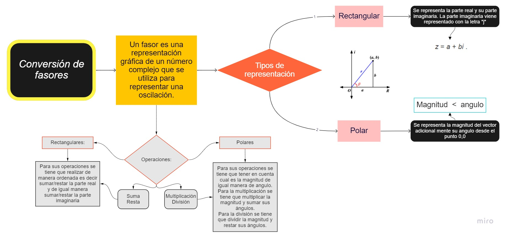

# Trabajo-Extra-3P

Tema: Creación de una Aplicación móvil en App inventor para la conversión de fasores (rectangular-polar) y operaciones con fasores.

1.- OBJETIVOS

Objetivo General:

Realizar un aplicativo simulando a una calculadora, mediante el uso eficiente de app inventor, de esta manera aplicar los conocimientos básicos de fasores.

Objetivos especificos:

Identificar las diversas herramientas que nos proporciona el aplicativa app invetor para el control de sus propiedades.

Visualizar las características principales de las transformaciones de números complejos, de esta manera ponerlos en práctica realizando una calculadora.

Presentar el funcionamiento correcto de lo creado, de esta forma realizar operaciones básicas con fasores.

2.- MARCO TEORICO 

¿Que son los fasores?

- Un fasor es una representación gráfica de un número complejo que se utiliza para representar una oscilación, de forma que el fasor suma de varios fasores puede representar la magnitud y fase de la oscilación resultante de la superposición de varias oscilaciones en un proceso de interferencia.

- Tambien, un fasor es un número complejo que representa la magnitud y la fase de una senoide. A este vector radial se le llama fasor en ingeniería eléctrica, y tiene magnitud constante con un extremo fijo en el origen. Los circuitos de voltaje y corriente alterna son excitados por fuentes senoidales.

¿Qué es App Inventor?

- Es una herramienta de desarrollo muy visual y más o menos sencilla de usar. Útil para los programadores sin experiencia, ya que permite desarrollar aplicaciones complejas y con una gran cantidad de funcionalidades. "Facilita la creación de aplicaciones de manera intuitiva y gráfica"

Las características más importantes de App Inventor son:

- Es software libre, no es necesario la adquisición de licencias por parte del profesor y los alumnos.

- Es multiplataforma: requiere sólo de un navegador y la máquina virtual de Java instalada, con “java web start”.

- Es programación para dispositivos móviles.

Numeros complejos.

- Los números complejos son la herramienta de trabajo del álgebra, análisis, así como de ramas de las matemáticas puras y aplicadas como variable compleja, ecuaciones diferenciales, facilita el cálculo de integrales, en aerodinámica, hidrodinámica y electromagnetismo entre otras de gran importancia.

Para sus transformaciones:

- Los numeros rectangulares complejos son aquellos que los representábamos en una recta (la recta real), los complejos tenemos que representarlos en un plano (el plano complejo), ya que tienen parte real y parte imaginaria.

- Los numeros polares son los que se encuentran en el eje horizontal es el eje real y el eje vertical es el eje imaginario. Encontramos los componentes reales y complejos en términos de r y θ donde r es la longitud del vector y θ es el ángulo hecho con el eje real.

Para sus transformaciones necesitamos tener en cuenta los conocimiemtos basicos de trigonometria estos: el teorema de pitagoras y las identidades de un triangulo rectangulo.

Del teorema de Pitágoras :

Por el uso de las relaciones trigonométricas básicas:

Multiplicando cada lado por r :

La forma rectangular de un número complejo está dada por

Sustituya los valores de a y b

Mapa conceptual 

3.- Procedimiento

- Ingresar a internt y buscar app inventor, ingresar y colocar en crear aplicacion.

- Inciar un nuevo proyecto y de esta manera colocar el nombre de la aplicacion y asi comenzar a diseñar el proyecto.

- En la parte izquierda se puede escoger cualquier tipo de señaletica que se desea colocar en la pantalla del movil que se encuentra en la mitad, mientras que en la parte derecha se puede observar 

- En la parte superior derecha dando click en blocks se puede realizar el codigo o funcionamiento del programa.

- Se puede  observar en la parte izquierda que se tiene todos elementos colocados en la pantalla y de esta manera se va a ocupar la parte de matematica y es por esto que se tiene que unicaamente arrastrar los elemento e ir uniendo.

Toda esta calculadora se podra ir realizando dependiendo la finalidad y sus caracteristicas principales. 

4.- Resultados

Para la transformacion de rectangulares a polares se tiene la aplicacion: 

La aplicacion tiene el siguiente codigo QR

Y su funcionamiento es: 

Para la transformacion de polares a rectangulares se tiene la aplicacion: 

La aplicacion tiene el siguiente codigo QR

Y su funcionamiento es: 

Para la suma y resta de los numeros complejos se tiene la aplicacion: 

La aplicacion tiene el siguiente codigo QR

Y su funcionamiento es: 

Para la multiplicacion y division de los numeros complejos se tiene la aplicacion: 

La aplicacion tiene el siguiente codigo QR

Y su funcionamiento es: 

5.- Video

6.- Conclusiones

- Gracias a todo lo anterior, podemos utilizar el sistema de la calculadora para tener las conversiones de los numeros complejos como tambien podemos realizar operaciones basicas de fasores como lo es suma, resta, multiplicacion y division.

- Se logro identificar las distintas herramientas que se tiene en el  aplicativo app inventor y de esta manera se logro ocupar algunos elementos para el diseño eficiente de la calculadora de fasores. 

- Gracias a la teoria como son las relaciones trigonométricas básica se tuvo un correcto funcionamieto del sistema ya que gracias al mismo se logro culminar de una manera eficiente el sistema.

- Mediante la explicaion en la parte 5 donde se preseta el video se pudo explicar desde cero como crear el app y sus distintas funcionalidaes e inclusive la instalacion en el celular y como es su funcionamiento. 

7.- Bibliografia.

- Luis, J. (23 de Mayo de 2020). Curso app inventor. Obtenido de https://www.youtube.com/watch?v=YoYyMRggpro
- 
- Meza, D. (24 de marzo de 2018). ING DIEGO. Obtenido de https://www.youtube.com/watch?v=yNj7gN4ELZ8
- 
- Paredes, E. (2019 de Abril de 2019). carakenio73. Obtenido de https://dademuch.com/2019/04/08/representacion-fasorial-de-corrientes-y-voltajes-fasores/

