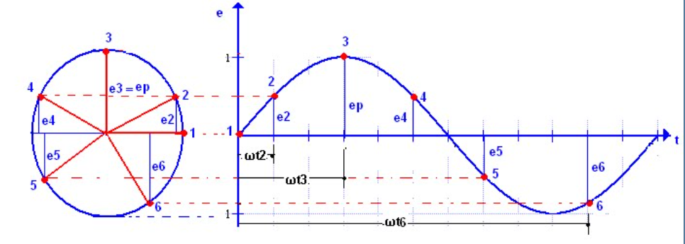
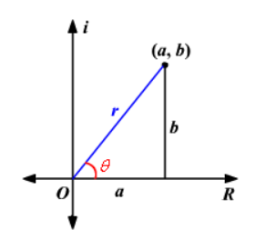
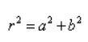
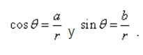
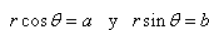
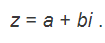
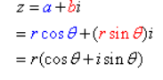

# Trabajo-Extra-3P

Tema: Creación de una Aplicación móvil en App inventor para la conversión de fasores (rectangular-polar) y operaciones con fasores.

1.- OBJETIVOS

Objetivo General:

Realizar un aplicativo simulando a una calculadora, mediante el uso eficiente de app inventor, de esta manera aplicar los conocimientos básicos de fasores.

Objetivos especificos:

Identificar las diversas herramientas que nos proporciona el aplicativa app invetor para el control de sus propiedades.

Visualizar las características principales de las transformaciones de números complejos, de esta manera ponerlos en práctica realizando una calculadora.

Presentar el funcionamiento correcto de lo creado, de esta forma realizar operaciones básicas con fasores.

2.- MARCO TEORICO 

¿Que son los fasores?

- Un fasor es una representación gráfica de un número complejo que se utiliza para representar una oscilación, de forma que el fasor suma de varios fasores puede representar la magnitud y fase de la oscilación resultante de la superposición de varias oscilaciones en un proceso de interferencia.

- Tambien, un fasor es un número complejo que representa la magnitud y la fase de una senoide. A este vector radial se le llama fasor en ingeniería eléctrica, y tiene magnitud constante con un extremo fijo en el origen. Los circuitos de voltaje y corriente alterna son excitados por fuentes senoidales.

¿Qué es App Inventor?

- Es una herramienta de desarrollo muy visual y más o menos sencilla de usar. Útil para los programadores sin experiencia, ya que permite desarrollar aplicaciones complejas y con una gran cantidad de funcionalidades. "Facilita la creación de aplicaciones de manera intuitiva y gráfica"

Las características más importantes de App Inventor son:

- Es software libre, no es necesario la adquisición de licencias por parte del profesor y los alumnos.

- Es multiplataforma: requiere sólo de un navegador y la máquina virtual de Java instalada, con “java web start”.

- Es programación para dispositivos móviles.

Numeros complejos.

- Los números complejos son la herramienta de trabajo del álgebra, análisis, así como de ramas de las matemáticas puras y aplicadas como variable compleja, ecuaciones diferenciales, facilita el cálculo de integrales, en aerodinámica, hidrodinámica y electromagnetismo entre otras de gran importancia.

Para sus transformaciones:

- Los numeros rectangulares complejos son aquellos que los representábamos en una recta (la recta real), los complejos tenemos que representarlos en un plano (el plano complejo), ya que tienen parte real y parte imaginaria.

- Los numeros polares son los que se encuentran en el eje horizontal es el eje real y el eje vertical es el eje imaginario. Encontramos los componentes reales y complejos en términos de r y θ donde r es la longitud del vector y θ es el ángulo hecho con el eje real.

Para sus transformaciones necesitamos tener en cuenta los conocimiemtos basicos de trigonometria estos: el teorema de pitagoras y las identidades de un triangulo rectangulo.

Del teorema de Pitágoras :

Por el uso de las relaciones trigonométricas básicas:

Multiplicando cada lado por r :

La forma rectangular de un número complejo está dada por

Sustituya los valores de a y b

Mapa conceptual 

3.- Procedimiento

4.- Resultados

5.- Video

6.- Conclusiones

7.- Bibliografia.

